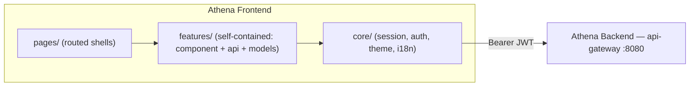

<div align="center">

# Athena Frontend

**The web client for Athena — an AI Learning Operating System.**

[](LICENSE)
[](package.json)
[](docs/Architecture.md)

</div>

---

## Overview

Athena is an AI Learning Operating System: instead of a static course catalogue, it
builds a personalized, continuously adapting curriculum around one learner. This
repository is the Angular web client — the roadmap visualization, the daily adaptive
learning journey, the knowledge-graph mastery map, achievements, interviews, and account
settings that a learner actually interacts with.

The backend it talks to — 12 Spring Boot microservices, event-driven, with a local-LLM
AI layer — lives in a [separate repository](https://github.com/Tamara556/Athena-Backend).
This repo is frontend-only; see [`docs/API-Integration.md`](docs/API-Integration.md) for
exactly how the two connect.

**Who this is for:** engineers interested in a Signals-first Angular architecture with
no global state library, and in a concrete pattern for building a UI feature-by-feature
against a backend that's being built in parallel — every feature here was built behind
one typed `Observable<T>` seam per feature, swappable from mock to real data with zero
blast radius elsewhere (see [`docs/Architecture.md`](docs/Architecture.md) §3).

---

## Features

| Category | What's implemented |
|---|---|
| **Auth** | Login/register (with optional avatar upload), phone-based 2FA verification, guarded routing |
| **Onboarding & Roadmap** | Goal → AI assessment wizard, generated roadmap visualization with phase completion |
| **Daily Journey** | Today's adaptive, block-by-block learning plan — start/skip/complete blocks, confidence check-ins, end-of-day reflection, plan adjustment |
| **Learning Sessions** | Per-roadmap-node lesson player: reading, video (with optional live YouTube search), practice, quiz stages |
| **Knowledge Graph** | Visual skill-mastery map (nodes/edges/insights) rendered from the backend's graph data |
| **Achievements** | Badge catalogue + earned badges, rarity/category presentation |
| **Streaks** | Activity heatmap and streak stats |
| **Settings & Security** | Account details, password/email change, 2FA setup, device-session management, login-activity review, self-service data export |
| **Interviews, Progress, Athena Insights, Profile narrative** | UI built and ready; several data sources are still typed placeholders pending matching backend contracts — see the honest inventory in [`docs/API-Integration.md`](docs/API-Integration.md) |
| **Platform** | Theming (light/dark/pink), 4-language i18n (English/Armenian/Russian/Korean), first-run guided tour |

---

## Architecture

Angular 20, standalone components only, **Signals for all state** (no NgRx/Redux),
lazy-loaded and guard-protected routes, plain CSS design system. Every feature's data
access goes through exactly one `*.api.ts` file — the single seam that's either real
`HttpClient` calls or typed placeholder data, and nothing else in the feature knows
which. Full design rationale, an auth-flow diagram, and an honest strengths/weaknesses
review: **[`docs/Architecture.md`](docs/Architecture.md)**.



---

## Tech stack

| Concern | Choice |
|---|---|
| Framework | Angular 20 (standalone components, new control flow) |
| State | Signals — no NgRx/Redux |
| HTTP | `HttpClient` + a functional auth interceptor |
| Reactive glue | RxJS 7.8 |
| Styling | Hand-written CSS, `[data-theme]`-driven — no Material/Tailwind/Bootstrap |
| Language | TypeScript, strict mode |
| Build | esbuild via `@angular/build` |
| Tests | Karma + Jasmine configured; **no tests written yet** (see `docs/Development.md`) |

---

## Folder structure

```
src/app/
├── core/        session, auth guard/interceptor, theme, i18n, errors
├── features/    one folder per feature — component + api + models (+ store/logic)
├── pages/       routed page shells (home, login, register, onboarding, roadmap, dashboard)
└── shared/       sidebar, theme-toggle, lang-select, first-run tour, small UI widgets
```

Full annotated tree: [`docs/Project-Structure.md`](docs/Project-Structure.md).

---

## Getting started

### Prerequisites
- Node.js compatible with Angular CLI 20 (20.19+ or 22.12+).
- [`Athena-Backend`](https://github.com/Tamara556/Athena-Backend) running locally
  (`docker compose up --build` in that repo) for the features that need it — mock-backed
  features work without it (see `docs/API-Integration.md`).

### Run
```bash
npm install
npm start
```
Open `http://localhost:4200`.

Full walkthrough — build, test, budgets: **[`docs/Development.md`](docs/Development.md)**.

---

## Backend integration

Every endpoint this app calls, and an honest real-vs-mock status per feature, is
documented in **[`docs/API-Integration.md`](docs/API-Integration.md)**, cross-referenced
against `Athena-Backend`'s own `docs/API.md`.

---

## Contributing

Contributions are welcome. Start with **[`CONTRIBUTING.md`](CONTRIBUTING.md)** for the
fork/branch/PR process, and **[`docs/Contributing.md`](docs/Contributing.md)** for the
repo-specific mechanics (adding a feature, swapping mock→real data). Please also read
**[`CODE_OF_CONDUCT.md`](CODE_OF_CONDUCT.md)**.

---

## Roadmap

Tracked in **[`ROADMAP.md`](ROADMAP.md)** — built only from what's verifiably true of
this codebase today (missing backend contracts, zero test coverage, no CI — never
invented features).

---

## License

[MIT](LICENSE).

---

## Support

- **Bugs / feature requests**: open a [GitHub Issue](https://github.com/Tamara556/Athena-Frontend/issues)
  using the provided templates.
- **Security vulnerabilities**: see **[`SECURITY.md`](SECURITY.md)** — please do not
  file a public issue for a suspected vulnerability.
- **Backend contract questions**: see `Athena-Backend`'s own documentation — this repo's
  `docs/API-Integration.md` is the frontend's view of that contract, not the source of
  truth for it.

---

## Acknowledgements

Built with Angular, and the backend team's parallel work on
[`Athena-Backend`](https://github.com/Tamara556/Athena-Backend) that this app is
designed to grow into as each contract lands.
