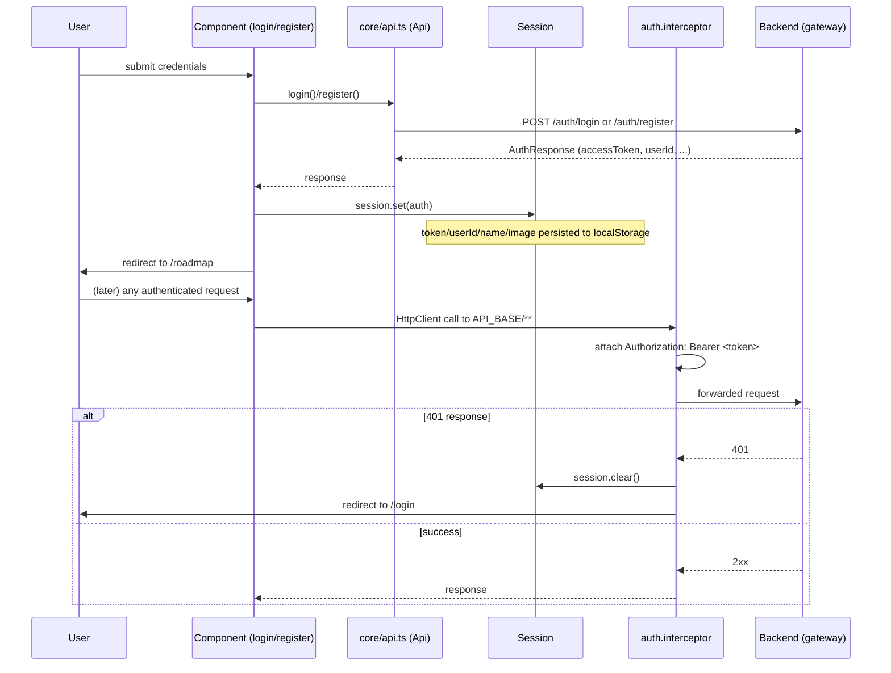

# Architecture

## 1. Stack and core choices

Angular 20, **standalone components only** (no `NgModule` anywhere), the new
`@if`/`@for` control-flow syntax, and **Signals** for all reactive state — there is no
NgRx, no Redux, no RxJS-based global store. RxJS (7.8) is used at the edges, for
`HttpClient` calls and the auth interceptor, not as an application-wide state
mechanism. Styling is hand-written CSS with a custom design system (theme tokens driven
by `[data-theme]`, see `docs/Theming-and-i18n.md`) — no Material, Tailwind, or
Bootstrap. Build tooling is esbuild via `@angular/build`. TypeScript runs in strict
mode.

Every route is lazy-loaded (`loadComponent`) and route-guarded (`authGuard` /
`guestGuard`) — see `app.routes.ts` and `docs/Project-Structure.md`.

## 2. Layering

```
core/       app-wide singletons: session, auth guard/interceptor, theme, i18n, errors
features/   one self-contained folder per feature: component + api + models (+ store/logic)
pages/      routed shells composing features for a given route
shared/     reusable, presentation-only components (no backend calls)
```

A feature's `*.api.ts` (or `*-api.service.ts`) is the **only** place that talks to the
backend — components never call `HttpClient` directly, and never call another
feature's API service. This is the single seam every feature is built around; see §3.

## 3. The mock-swappable API seam (the most load-bearing pattern in this codebase)

This project was built feature-by-feature against a backend that was itself being
built out feature-by-feature. Rather than blocking the UI on backend availability, every
feature's `*.api.ts` was written as the **one and only** place that would eventually
call `HttpClient` — and until the corresponding backend endpoint existed, that same
file returned typed, static, or empty (`of(...)`) data instead. Nothing else in the
feature — the component, the store, the templates — knows or cares which mode its
`*.api.ts` is in, because the `Observable<T>` contract is identical either way. That's
what makes the swap safe: flipping a feature from mock to real is a change confined to
one file.

As of this writing, verified by reading every `*.api.ts` / `*-api.service.ts`:

| Feature | Status | Backend contract |
|---|---|---|
| Auth (register/login/2FA) | **Real** | `auth-service` via `core/api.ts` |
| Onboarding, Roadmap, Daily Plan | **Real** | `ai-service` via `core/api.ts` |
| Settings (account, 2FA, devices, export) | **Real** | `auth-service` + `user-service` |
| Streaks | **Real** | `progress-service` (`GET /progress/streaks`) |
| Daily Journey | **Real** | `ai-service` (`/daily-journey/**`, full lifecycle) |
| Learning Session | **Real** | `ai-service` (`/learning-sessions/**`) + optional live YouTube search |
| Achievements (catalogue + earned) | **Real** | `badge-service` (`/badges`, `/badges/me`); AI-suggestion and per-badge progress sub-fields still return `of([])` — no backend contract for those two yet |
| Knowledge Graph (visualization) | **Real** | `ai-service` (`/ai/knowledge-graph/me/visualization`); evolution timeline and opportunity/accelerator recommendation cards still return `of(null)`/`of([])` |
| Profile | **Partial** | identity + learning preferences are real (delegate to Settings); narrative, learning direction, AI insights, and milestones are still `of(null)`/`of([])` — no backend contract |
| Athena Insights | **Wired, backend missing** | calls `GET /ai/insights/me` and gracefully falls back to an empty-state profile on error — this endpoint does not exist on the backend yet (see `Athena-Backend`'s `ROADMAP.md`) |
| Progress (growth story) | **Mock** | every data getter returns `of([])`/empty view models except the static reflection prompts; no backend contract exists for a narrative progress endpoint |
| Interviews (overview/prep/mock-practice) | **Mock** | every method returns `of(null)`/`of([])`, with static content for tips/impacts/mock-intensity levels; `interview-service` exists on the backend but this page was never wired to it |

This table will drift the moment either repo changes — treat it as a snapshot verified
against the source on the date in `docs/OSS-READINESS-REPORT.md`, not a permanent fact.

## 4. Auth flow



- **2FA**: if the backend returns a 2FA challenge from `/auth/login`, the flow completes
  via `POST /auth/2fa/verify` before `Session.set()` is called.
- **No silent refresh**: the backend exposes `/auth/refresh`, but the frontend does not
  currently call it — a 401 always clears the session and sends the user to `/login`
  rather than attempting a token refresh (see `docs/Security.md` and `ROADMAP.md`).
- Session state (`token`, `userId`, `sessionId`, `name`, `image`) is plain
  `localStorage`, read into Signals at construction — there is no cookie-based or
  in-memory-only token storage option today.

## 5. Design review

### Strengths
- The mock-swappable API seam (§3) is genuinely disciplined — every feature's mock/real
  status is a one-file fact, never smeared across components, which is exactly what
  makes finishing backend integration low-risk, one feature at a time.
- Signals-only state management keeps the mental model simple — no separate global
  store to keep in sync with the backend.
- Consistent feature-folder shape (`component` / `api` / `models` [/ `store` / `logic`])
  makes any feature predictable to navigate regardless of who wrote it.
- A real i18n system (4 languages) and a real 3-way theme system exist as first-class
  app-wide services, not bolted on per-page.

### Weaknesses / risks
- **No tests exist** — zero `.spec.ts` files in the repository despite Karma/Jasmine
  being fully configured in `package.json`/`angular.json`. The mock-swappable seam
  would be an easy thing to unit test (mock `HttpClient`, assert the `Observable<T>`
  contract) but nothing currently does.
- **No silent token refresh** — a 401 always logs the user out, even though the backend
  supports rotating a refresh token; every session is capped at the access-token TTL
  (15 minutes by backend default).
- **Four features are fully or partially mock** (Progress, Interviews, and parts of
  Profile/Knowledge Graph/Achievements) because the backend doesn't yet expose a
  matching contract — expected and by design, but worth tracking centrally rather than
  only in code comments (this document + `ROADMAP.md` now do that).
- **No CI** — no GitHub Actions workflow builds or lints this repository on push/PR
  (contrast with the backend's `ci.yml`).

See `docs/OSS-READINESS-REPORT.md` for the full scored assessment.
